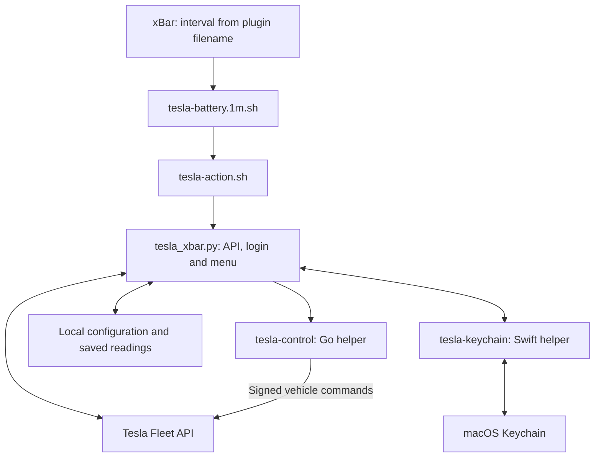

# Tesla xBar

[](https://github.com/kolisko/tesla-xbar/actions/workflows/ci.yml)
[](https://github.com/kolisko/tesla-xbar/actions/workflows/codeql.yml)
[](LICENSE)

Your Tesla's battery range or percentage in the macOS menu bar, powered by the official Fleet API. Built for [xBar](https://xbarapp.com/), with English menus, local credential storage and explicit charging and climate controls.


## See it in action

Open the menu to see battery percentage, Tesla's range, charge limit, cable connection, charging power and the time of the last reading.


*Illustrated previews with fictional data and a neutral background. Native fonts, emoji and transparency vary with macOS and xBar. No personal desktop screenshots are included.*


Open **Clima** to see inside and outside temperatures, change climate modes, turn climate on or off, or set the target temperature for both front zones. Measured temperatures are shown separately from **Target temperature**.


## Features

- **Range or percentage:** switch through **Menu bar display**. Range comes directly from Tesla's range fields and uses the vehicle's distance units.
- **Cable and charging status:** green text when connected, including scheduled or paused charging. Fresh online charging adds a monochrome lightning icon before the label, matching the other status icons.
- **Live vehicle indicators:** a tent for Camp Mode, a paw for Pet Mode, a fan while climate is on, and an open padlock when the vehicle is unlocked. Active indicators appear together before the range or percentage; their names also appear in the menu.
- **Low-range colors:** orange below 350 km and red below 300 km when unplugged. Connected cable status takes precedence.
- **Last known data:** asleep, offline and unverified readings keep the saved range or percentage without a status icon or dot. A last known connected cable keeps the text green; otherwise it becomes muted gray. This also applies after a failed refresh or when a reading is at least 30 minutes old. The connection state and original reading timestamp stay visible in the menu.
- **One refresh schedule:** xBar's filename controls polling (`1m`, `5m`, etc.). **Refresh now** uses the same path. No second polling timer or invented monthly quota.
- **Explicit commands:** wake and refresh, start/stop charging, open/close the charge port, and climate controls. Normal refresh never sends a wake or climate command.
- **Clima submenu:** normal climate, Keep Climate On, Camp Mode, Pet Mode, temperature selection in 0.5 °C steps, modes off, and full climate/modes off. Temperature choices use the limits reported by the vehicle and set both front zones; changing the target alone does not turn climate on. Normal climate and full shutdown exit an active keeper mode first. Clicked actions can wake an unavailable vehicle before sending the command.
- **Private profiles:** tokens and Client Secret in Keychain; configuration, signing key and cached readings in the current user's Application Support directory.
- **Updates preserve your setup:** existing keys, credentials, readings and xBar interval remain intact.

## Architecture

xBar schedules the plugin and displays its text output. The Tesla integration runs as local processes for each refresh or selected menu action; it does not install a persistent Tesla server or a second polling scheduler.



| Component | Responsibility |
| --- | --- |
| `tesla-battery.1m.sh` | Small shell entry point in xBar's plugin directory. Its filename supplies the refresh interval. |
| `tesla-action.sh` | Generated shell launcher that uses the Python interpreter selected during installation. Menu actions also call this launcher. |
| [`tesla_xbar.py`](src/tesla_xbar.py) | Python standard-library application: Fleet API requests, OAuth and token renewal, cached readings, menu rendering and action handling. |
| [`icons/`](src/icons/README.md) | Prebuilt monochrome image strips for climate modes, running climate and an unlocked vehicle. Python includes the matching PNG in xBar's output; macOS supplies its tint. No runtime image renderer is needed. |
| `tesla-keychain`, built from [`keychain.swift`](src/keychain.swift) | Small Swift executable that accesses macOS Keychain. Secrets are passed to it through stdin. |
| `tesla-control`, built by [`build_commands.py`](scripts/build_commands.py) | Tesla's Go command tool, built from a pinned revision with a small [climate-keeper CLI adapter](src/commands/README.md). Python invokes it for commands requiring vehicle signatures. The SDK checkout remains unchanged. |
| [`install.py`](scripts/install.py) | Builds the helpers, installs the runtime and launchers, and creates a signing key for a new profile. Updates reuse the existing private profile. |

A normal refresh checks vehicle availability and reads live data when available; otherwise it retains the last known reading. Wake is a separate, explicit action. The Python application sends ordinary API requests itself and delegates commands requiring signatures to the Go helper.

The same `vehicle_data` request includes `charge_state`, `gui_settings`, `climate_state` and `vehicle_state`. Climate and lock indicators require no additional API calls or permissions beyond the existing vehicle-data access. Saved climate fields are limited to the keeper mode, on/off state, inside/outside temperatures, both front temperature settings and the vehicle's available temperature limits; the saved lock field is `locked`. Each section keeps its own reading timestamp. Clima actions use the existing `vehicle_cmds` scope and paired signing key, where required. See [Tesla's documented commands](https://developer.tesla.com/docs/fleet-api/endpoints/vehicle-commands).

Browser sign-in starts a temporary HTTP listener on the Mac's loopback interface, using the configured callback port. It closes when sign-in completes or times out. Later refreshes renew tokens as needed without opening a browser. The public HTTPS site serves only the **public key**: it does not relay the callback, run the plugin or store credentials.

## Repository layout

Each directory has a Markdown guide describing its contents. Most use `README.md`; `.github/OVERVIEW.md` keeps GitHub from replacing the main project README with the directory guide.

| Directory | Contents |
| --- | --- |
| [`src/`](src/README.md) | Python application, Swift Keychain helper, [Go CLI adapter](src/commands/README.md) and [status icon assets](src/icons/README.md). |
| [`scripts/`](scripts/README.md) | Installer, pinned command-helper build, privacy check and preview generator. |
| [`tests/`](tests/README.md) | Automated tests using fake Tesla clients and temporary profiles. |
| [`examples/`](examples/README.md) | Placeholder configuration for your own setup. |
| [`docs/`](docs/README.md) | Setup guide, third-party notices and visual previews in [`docs/images/`](docs/images/README.md). |
| [`.github/`](.github/OVERVIEW.md) | Contribution and security policies, Dependabot configuration and [CI workflows](.github/workflows/README.md). |

The xBar shell scripts are generated by [`scripts/install.py`](scripts/install.py) during installation, so they contain paths for the current Mac. They are installed outside the checkout, alongside the existing private profile. Build outputs go into the ignored `build/` directory.

## Install

Requires macOS, xBar, Python 3.9+, Go 1.23+, OpenSSL, Git and Apple's Command Line Tools. The installer builds the small Swift Keychain helper and Tesla's official command helper from a pinned source revision.

```sh
git clone https://github.com/kolisko/tesla-xbar.git
cd tesla-xbar
python3 -m scripts.install
```

**You need your own Tesla Developer app, credentials and public-key hosting domain.** This project does not supply shared credentials or a hosted Tesla backend. Follow the [complete setup guide](docs/SETUP.md) to publish your public key, configure the developer app, register its region and connect your account.

Tesla controls app approval, API availability, permissions and billing. See [Tesla Fleet API billing](https://developer.tesla.com/docs/fleet-api/billing-and-limits) before enabling polling.

## Configuration

The default installation keeps one private profile per macOS user in `~/Library/Application Support/Tesla xBar/`. The runtime and helper executables are installed there too; the small entry-point script lives in `~/Library/Application Support/xbar/plugins/`.

Choose **Settings…** in the plugin menu to open the interactive Terminal prompts for Client ID, Client Secret, public-key domain, Fleet API region and redirect URI. The Client Secret prompt is hidden; pressing Enter keeps its saved value. Then register the region and choose **Connect Tesla account…** as described in the [setup guide](docs/SETUP.md#4-configure-register-the-region-and-sign-in).

| Setting | How it is configured |
| --- | --- |
| Client ID, domain, region and callback | **Settings…** writes `client_id`, `domain`, `region` and `redirect_uri` to `config.json`. Region defaults to `eu` (`na` and `cn` are also supported); the default callback is `http://localhost:8765/callback`. |
| Client Secret and account access | **Settings…** saves the secret in Keychain. **Connect Tesla account…** obtains the access and refresh tokens; renewal is automatic while authorization remains valid. |
| Vehicle | **Select vehicle** appears for multiple vehicles and saves the selected `vin` in `config.json`. |
| Range or percentage | **Menu bar display** saves `display_mode` as `range` (default) or `percent`. This is a local choice, independent of the Tesla mobile app's display preference. |
| Refresh interval | Managed by xBar's plugin filename: `tesla-battery.1m.sh` runs every minute; `tesla-battery.5m.sh` runs every five minutes. Change it through xBar's plugin management. There is no separate interval in `config.json`. |

[`config.example.json`](examples/config.example.json) shows placeholder settings for reference. It is not the live configuration file and is not automatically copied over your profile. The color thresholds (orange below 350 km, red below 300 km when unplugged) are currently code constants, not configurable JSON fields.

| Stored item | Contents and handling |
| --- | --- |
| `config.json` | Settings and app-registration state. It contains account-specific details such as Client ID, domain and selected VIN; keep it private even though it does not hold tokens or the Client Secret. |
| macOS Keychain, service `cz.tesla-xbar` | Client Secret and OAuth access/refresh tokens. These are separate from the profile's JSON files. |
| `command-key.pem` | Private P-256 signing key, generated locally for a new profile. Keep it private and back it up securely. |
| `public-key.pem` | Matching public key. **Only this key** is copied to your public HTTPS domain's well-known Tesla path. |
| `cache.json` | Last known vehicle data and reading timestamps. It is generated runtime state, not a file to edit for configuration. |
| Other runtime files | Command sessions, action results, notices and a rendered display snapshot. These stay in the private profile and must not be included in issues or commits. |

Updates preserve the existing settings, keys and saved readings. Changing the Client ID is a change of Tesla application: the current login is cleared and the app must be registered and connected again. Follow the [setup guide](docs/SETUP.md) for public-key hosting, registration, consent and vehicle-key pairing.

## Privacy and security

The public project contains code, tests and demonstration graphics. Private configuration lives in:

```text
~/Library/Application Support/Tesla xBar/
```

OAuth tokens and Client Secret use macOS Keychain. Signing keys are generated outside the checkout, and private files use restricted permissions. Each user has their own Tesla registration and keys. No analytics or vehicle location is collected by the plugin.

The temporary OAuth callback runs only on localhost. Signed command tokens travel through stdin rather than process arguments or temporary files. Physical commands are bound to the vehicle displayed in the menu. Concurrent manual actions are rejected with a visible notice instead of queued.

GitHub checks include **CodeQL for Python and Swift, Gitleaks, a privacy scan, Dependabot, unit tests, macOS builds and a Go dependency vulnerability audit**. See [SECURITY.md](.github/SECURITY.md) for the security model and private vulnerability reporting.

## Behavior and limits

- Offline is not proof of sleep. An HTTP 408 is treated as unavailable. The menu distinguishes confirmed sleep from offline status. Both keep green text when the last known cable state is connected, and use muted gray otherwise.
- Green can reflect a saved cable connection. A disconnection cannot be reflected until new vehicle data is received; the menu labels the saved state as **Last known cable state**. Only confirmed live charging gets a lightning symbol.
- An offline/asleep reading can be old. The plugin keeps it and shows its timestamp; it never fabricates a fresh value.
- Climate and unlock icons require an online vehicle, a successful refresh and a section timestamp less than 30 minutes old. They disappear for offline/asleep states, failed refreshes or stale data; saved status text in the menu is then labeled **Last known**. Missing fields do not imply that climate is on or the car is unlocked. Icons reflect the last successful poll, not a push connection to the car.
- Range is never estimated from battery percentage. API miles are converted to kilometers only when required by the vehicle's units.
- Range/percentage selection is local. Automatic synchronization with the Tesla mobile app's display preference is not implemented.
- Smooth green pulsing is not implemented; charging uses a static green label and lightning icon.
- Avoiding wake commands does not guarantee that frequent live data reads cannot delay an already awake vehicle's sleep. Tesla recommends Fleet Telemetry for ongoing data needs; this local plugin uses polling. See [Tesla's API best practices](https://developer.tesla.com/docs/fleet-api/getting-started/best-practices).
- Signed charging and climate commands may require pairing the app key in the Tesla mobile app. Charging schedules, current and charge limit are not changed by the plugin. Turning climate and modes off does not change Cabin Overheat Protection or scheduled preconditioning settings.
- **Command accepted** is not the same as confirmed physical state. Confirmation appears only after a subsequent vehicle data read verifies the change.
- A climate transition can involve two commands. If only the first succeeds, the menu reports partial acceptance and refreshes the state; it does not retry the failed command automatically.

## Update

```sh
git pull --ff-only
python3 -m scripts.install
```

For runtime and icon updates with unchanged helpers, use `python3 -m scripts.install --runtime-only`. Change intervals through xBar's plugin management so the running app picks up the new filename.

**The Clima controls update requires a full installation** (`python3 -m scripts.install`) to build the new climate-keeper adapter. Runtime-only installation does not rebuild an older command helper.

## Development

```sh
python3 -B -m unittest discover -s tests
python3 scripts/check_public_files.py
```

The tests use fake Tesla clients and temporary profiles; they do not send commands to real vehicles. See [CONTRIBUTING.md](.github/CONTRIBUTING.md).

## License

MIT for this project's code and illustrations. Tesla's separately built command SDK is Apache-2.0; see [third-party notices](docs/THIRD_PARTY_NOTICES.md). This project is independent and is not affiliated with or endorsed by Tesla or xBar.
