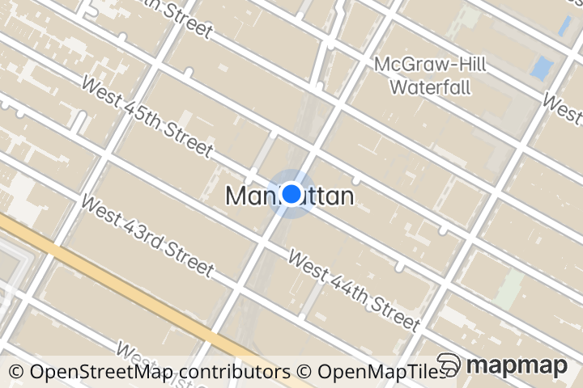
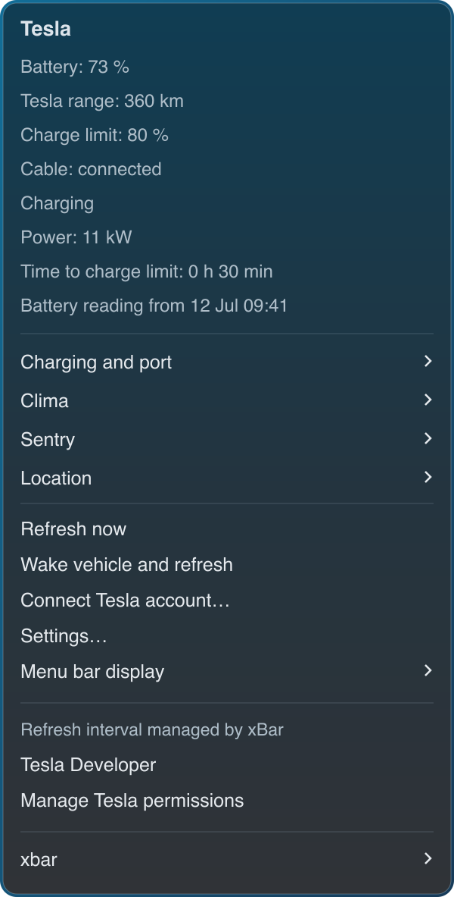
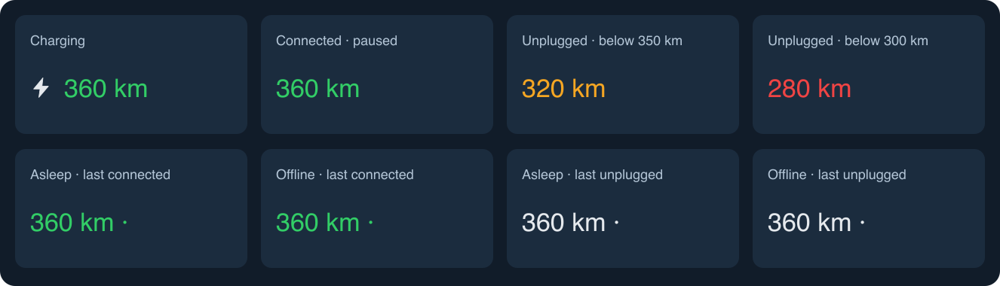
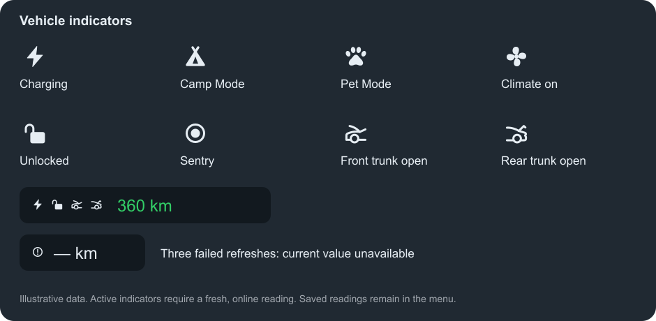
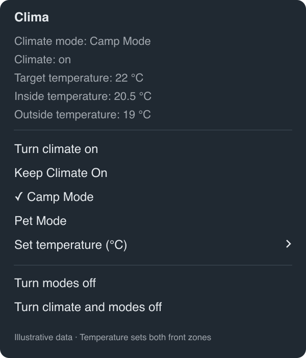
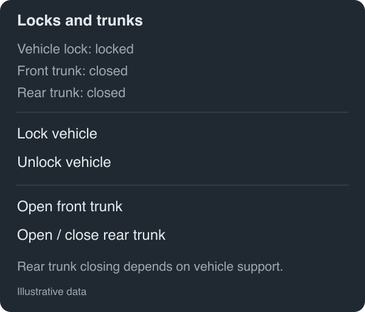
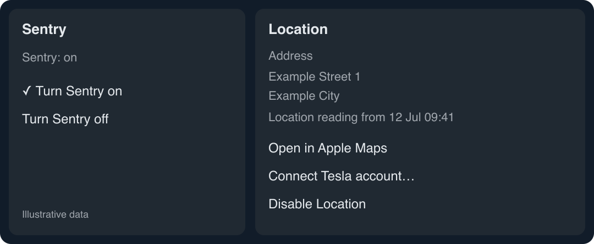

# Tesla xBar

[](https://github.com/kolisko/tesla-xbar/actions/workflows/ci.yml)
[](https://github.com/kolisko/tesla-xbar/actions/workflows/codeql.yml)
[](LICENSE)

**Current release: [v0.2.0](https://github.com/kolisko/tesla-xbar/releases/tag/v0.2.0)** · [Changelog](docs/CHANGELOG.md)

Your Tesla's battery range or percentage in the macOS menu bar, powered by the official Fleet API. Built for [xBar](https://xbarapp.com/), with English menus, local credential storage and charging, lock, trunk, climate and Sentry controls.


## See it in action

See your vehicle's position on a real map directly inside **Location**. The current MapMap preview uses a blue vehicle dot with POI pins hidden; the submenu also shows the address, reading time and a link to Apple Maps.

<a href="docs/images/sentry-location.png"></a>

*Public landmark demo: Times Square, New York. This is the map style used by the plugin, with a fictional vehicle position—not a user's home or saved vehicle location. Click the map to see it inside the Location submenu.*

Open the menu to see battery percentage, Tesla's range, charge limit, cable connection, charging power and the time of the last reading.



*Illustrated previews with fictional data and a neutral background. Native fonts, emoji and transparency vary with macOS and xBar. No personal desktop screenshots are included.*





Open **Clima** to see inside and outside temperatures, change climate modes, turn climate on or off, or set the target temperature for both front zones. Measured temperatures are shown separately from **Target temperature**.



Open **Locks and trunks** to lock/unlock the vehicle, open the front trunk or open/close the rear trunk. Rear trunk closing depends on the vehicle; there is no front-trunk close command.



Open **Sentry** for on/off controls and **Location** for the address, optional map preview and Apple Maps link.



## Features

- **Range or percentage:** switch through **Menu bar display**. Range comes directly from Tesla's range fields and uses the vehicle's distance units.
- **Cable and charging status:** green text when connected, including scheduled or paused charging. Fresh online charging adds a monochrome lightning icon before the label, matching the other status icons.
- **Live vehicle indicators:** a tent for Camp Mode, a paw for Pet Mode, a fan while climate is on, an open padlock when the vehicle is unlocked, a concentric-circle Sentry symbol when Sentry is on, and separate car silhouettes for an open front or rear trunk. The trunk indicators use their own closure readings independently of the lock state; both can appear together. Active indicators appear together before the range or percentage; their states also appear in the menu.
- **Low-range colors:** orange below 350 km and red below 300 km when unplugged. Connected cable status takes precedence.
- **Last known data:** asleep and offline readings keep the saved range or percentage and add a small trailing dot, such as `360 km ·` or `73% ·`. Connection state does not change the text color: a last known connected cable stays green, and unplugged readings keep the normal range colors. Failed or stale readings retain their values and colors too; the dot specifically indicates offline/asleep. The connection state and original reading timestamp stay visible in the menu.
- **One refresh schedule:** xBar's filename controls polling (`1m`, `5m`, etc.). **Refresh now** uses the same path. No second polling timer or invented monthly quota.
- **Explicit commands:** wake and refresh, start/stop charging, open/close the charge port, climate and Sentry controls, lock/unlock, and front/rear trunk controls. Normal refresh only reads vehicle state and never sends a physical command.
- **Clima submenu:** normal climate, Keep Climate On, Camp Mode, Pet Mode, temperature selection in 0.5 °C steps, modes off, and full climate/modes off. Temperature choices use the limits reported by the vehicle and set both front zones; changing the target alone does not turn climate on. Normal climate and full shutdown exit an active keeper mode first. Clicked actions can wake an unavailable vehicle before sending the command.
- **Sentry submenu:** turn Sentry on or off using the existing Vehicle Commands permission. The active icon uses the same size, monochrome tint and placement as the other indicators.
- **Locks and trunks submenu:** lock/unlock the vehicle, open the front trunk and toggle the rear trunk, with current or last-known lock and trunk readings. Actions use the existing Vehicle Commands permission and signing key. A rear-trunk toggle follows the vehicle's current position; it is never retried automatically after an uncertain result. Rear closing requires vehicle support.
- **Location submenu (optional):** address, reading time, a MapMap preview with a blue vehicle dot and no POI pins, and an Apple Maps link. Requires Vehicle Location consent; map sharing is separately enabled and needs no map API key. Offline data is explicitly labeled as last known.
- **Private profiles:** tokens and Client Secret in Keychain; configuration, signing key and cached readings in the current user's Application Support directory.
- **Updates preserve your setup:** existing keys, credentials, readings and xBar interval remain intact.

## Architecture

See [Architecture](docs/ARCHITECTURE.md) for the diagram, layer boundaries, runtime components, communication flow and configuration ownership.

## Repository layout

Each directory has a Markdown guide describing its contents. Most use `README.md`; `.github/OVERVIEW.md` keeps GitHub from replacing the main project README with the directory guide.

| Directory | Contents |
| --- | --- |
| [`src/`](src/README.md) | Modular Python application, Swift Keychain helper, [Go CLI adapter](src/commands/README.md) and [status icon assets](src/icons/README.md). |
| [`scripts/`](scripts/README.md) | Installer, pinned command-helper build, privacy check and preview generator. |
| [`tests/`](tests/README.md) | Automated tests using fake Tesla clients and temporary profiles. |
| [`examples/`](examples/README.md) | Placeholder configuration for your own setup. |
| [`docs/`](docs/README.md) | Setup guide, third-party notices and visual previews in [`docs/images/`](docs/images/README.md). |
| [`.github/`](.github/OVERVIEW.md) | Contribution and security policies, Dependabot configuration and [CI workflows](.github/workflows/README.md). |

The xBar shell scripts are generated by [`scripts/install.py`](scripts/install.py) during installation, so they contain paths for the current Mac. They are installed outside the checkout, alongside the existing private profile. Build outputs go into the ignored `build/` directory.

## Install

Requires macOS, xBar, Python 3.9+, Go 1.23+, OpenSSL, Git and Apple's Command Line Tools. The installer builds the Swift Keychain, address and map-image helpers and Tesla's official command helper from a pinned source revision.

```sh
git clone https://github.com/kolisko/tesla-xbar.git
cd tesla-xbar
python3 -m scripts.install
```

**You need your own Tesla Developer app, credentials and public-key hosting domain.** This project does not supply shared credentials or a hosted Tesla backend. Follow the [complete setup guide](docs/SETUP.md) to publish your public key, configure the developer app, register its region and connect your account.

Tesla controls app approval, API availability, permissions and billing. See [Tesla Fleet API billing](https://developer.tesla.com/docs/fleet-api/billing-and-limits) before enabling polling.

## Configuration

The default installation keeps one private profile per macOS user in `~/Library/Application Support/Tesla xBar/`. The runtime and helper executables are installed there too; the small entry-point script lives in `~/Library/Application Support/xbar/plugins/`.

Choose **Settings…** in the plugin menu to open the interactive Terminal prompts for Client ID, Client Secret, public-key domain, Fleet API region and redirect URI. The Client Secret prompt is hidden; pressing Enter keeps its saved value. Then register the region and choose **Connect Tesla account…** as described in the [setup guide](docs/SETUP.md#4-configure-register-the-region-and-sign-in).

| Setting | How it is configured |
| --- | --- |
| Client ID, domain, region and callback | **Settings…** writes `client_id`, `domain`, `region` and `redirect_uri` to `config.json`. The initial region defaults to `eu` (choices: `eu`, `na`, `cn`) and is verified after sign-in; the default callback is `http://localhost:8765/callback`. |
| Client Secret and account access | **Settings…** saves the secret in Keychain. **Connect Tesla account…** obtains the access and refresh tokens; renewal is automatic while authorization remains valid. |
| Vehicle | **Select vehicle** appears for multiple vehicles and saves the selected `vin` in `config.json`. |
| Location | **Location → Enable Location…** sets `location_enabled` to `true` and requests `vehicle_location` consent. This shares vehicle coordinates with Apple to find an address. Default is disabled. **Disable Location** stops collection and clears the saved location/address; revoke the Tesla grant separately if desired. |
| Map preview | **Location → Enable map preview** sets `location_map_enabled` to `true`. Default is disabled. It shares a viewport centered on the vehicle with MapMap. **Hide map preview** stops map requests and removes the cached map. No MapMap account or API key is needed. |
| Range or percentage | **Menu bar display** saves `display_mode` as `range` (default) or `percent`. This is a local choice, independent of the Tesla mobile app's display preference. |
| Refresh interval | Managed by xBar's plugin filename: `tesla-battery.1m.sh` runs every minute; `tesla-battery.5m.sh` runs every five minutes. Change it through xBar's plugin management. There is no separate interval in `config.json`. |

The shared [`settings schema`](src/tesla_bar/domain/settings.py) defines defaults, menu choices and validation for profile loading, the Terminal prompts, the optional local browser form (`tesla-action.sh provision`), and installer checks. Neither installer path rewrites existing settings. Saving the same application settings preserves its cached readings; changing Client ID requires the new app’s secret and clears the old login/vehicle selection.

[`config.example.json`](examples/config.example.json) shows placeholder settings for reference. It is not the live configuration file and is not automatically copied over your profile. The color thresholds (orange below 350 km, red below 300 km when unplugged) are currently code constants, not configurable JSON fields.

| Stored item | Contents and handling |
| --- | --- |
| `config.json` | Settings and app-registration state. It contains account-specific details such as Client ID, domain and selected VIN; keep it private even though it does not hold tokens or the Client Secret. |
| macOS Keychain, service `cz.tesla-xbar` | Client Secret and OAuth access/refresh tokens. These are separate from the profile's JSON files. |
| `command-key.pem` | Private P-256 signing key, generated locally for a new profile. Keep it private and back it up securely. |
| `public-key.pem` | Matching public key. **Only this key** is copied to your public HTTPS domain's well-known Tesla path. |
| `cache.json` | Last known vehicle data and reading timestamps. It is generated runtime state, not a file to edit for configuration. |
| `location-map.png` | Latest map with its vehicle marker. Its identity and checksum are in `cache.json`; both are private. Disabling Location or the map preview deletes the image. |
| Other runtime files | Command sessions, action results, notices and a rendered display snapshot. These stay in the private profile and must not be included in issues or commits. |

Updates preserve the existing settings, keys and saved readings. Changing the Client ID is a change of Tesla application: the current login is cleared and the app must be registered and connected again. Follow the [setup guide](docs/SETUP.md) for public-key hosting, registration, consent and vehicle-key pairing.

## Privacy and security

The public project contains code, tests and demonstration graphics. Private configuration lives in:

```text
~/Library/Application Support/Tesla xBar/
```

OAuth tokens and Client Secret use macOS Keychain. Signing keys are generated outside the checkout, and private files use restricted permissions. Each user has their own Tesla registration and keys. No analytics is collected. Location is disabled by default. If enabled, the latest vehicle coordinates and address are kept in the private profile (including the rendered menu snapshot), not a travel history. Coordinates are sent to Apple for address lookup and when opening the map; Tesla tokens, VIN and account details are not sent to Apple. The project maintainer receives none of this data.

The temporary OAuth callback runs only on localhost. Signed command tokens travel through stdin rather than process arguments or temporary files. Physical commands are bound to the vehicle displayed in the menu. Concurrent manual actions are rejected with a visible notice instead of queued.

The map preview is separately opt-in. MapMap receives map bounds centered on the vehicle, so it can infer the position. It receives no Tesla credentials, VIN, account details or address. The PNG and its embedded copy in `display.txt` are private location data and must not be published. They stay in Application Support; no Documents-folder or Mac location permission is needed. Provider attribution is preserved. See [MapMap's static image documentation](https://mapmap.ai/news/static-map-images).

GitHub checks include **CodeQL for Python and Swift, Gitleaks, a privacy scan, Dependabot, unit tests, macOS builds and a Go dependency vulnerability audit**. See [SECURITY.md](.github/SECURITY.md) for the security model and private vulnerability reporting.

## Behavior and limits

- Offline is not proof of sleep. An HTTP 408 is treated as unavailable. The menu distinguishes confirmed sleep from offline status. Both add a small dot after the range or percentage and keep the usual cable/range color, rather than switching to gray.
- Green can reflect a saved cable connection. A disconnection cannot be reflected until new vehicle data is received; the menu labels the saved state as **Last known cable state**. Only confirmed live charging gets a lightning symbol.
- An offline/asleep reading can be old. The plugin keeps it and shows its timestamp; it never fabricates a fresh value.
- Climate, unlock, Sentry and trunk icons require an online vehicle, a successful refresh and a section timestamp less than 30 minutes old. They disappear for offline/asleep states, failed refreshes or stale data; saved status text in the menu is then labeled **Last known**. Missing fields do not imply that climate is on, the car is unlocked or a trunk is open. Icons reflect the last successful poll, not a push connection to the car.
- An address is the closest postal address returned by Apple, not a guarantee of the exact parking bay or house number. If lookup fails, the coordinate-based map link remains available. Tesla may show a location-sharing indicator in the vehicle while location is being requested.
- Range is never estimated from battery percentage. API miles are converted to kilometers only when required by the vehicle's units.
- Range/percentage selection is local. Automatic synchronization with the Tesla mobile app's display preference is not implemented.
- Smooth green pulsing is not implemented; charging uses a static green label and lightning icon.
- Avoiding wake commands does not guarantee that frequent live data reads cannot delay an already awake vehicle's sleep. Tesla recommends Fleet Telemetry for ongoing data needs; this local plugin uses polling. See [Tesla's API best practices](https://developer.tesla.com/docs/fleet-api/getting-started/best-practices).
- Signed charging, climate, Sentry, lock and trunk commands may require pairing the app key in the Tesla mobile app. Charging schedules, current and charge limit are not changed by the plugin. Turning climate and modes off does not change Cabin Overheat Protection or scheduled preconditioning settings.
- **Command accepted** is not the same as confirmed physical state. Confirmation appears only after a subsequent vehicle data read verifies the change.
- A climate transition can involve two commands. If only the first succeeds, the menu reports partial acceptance and refreshes the state; it does not retry the failed command automatically.
- Lock and trunk actions refresh the state after acceptance. The menu reports vehicle confirmation only when a new reading shows the expected state (or a changed rear-trunk position). Trunk "open" includes an unlatched/ajar reading; it does not prove the lid has finished moving. If the change is not yet visible, the menu keeps **Command accepted** until ordinary refresh updates the readings.

## Update

```sh
git pull --ff-only
python3 -m scripts.install
```

For runtime and icon updates with unchanged helpers, use `python3 -m scripts.install --runtime-only`. Change intervals through xBar's plugin management so the running app picks up the new filename.

**The Location map update requires a full installation** (`python3 -m scripts.install`) to build `tesla-map-image`. This also builds the geocoder and climate-keeper adapter. Runtime-only installation requires all helpers to be installed already.

## Development

```sh
python3 -B -m unittest discover -s tests
python3 scripts/check_public_files.py
```

The tests use fake Tesla clients and temporary profiles; they do not send commands to real vehicles. See [CONTRIBUTING.md](.github/CONTRIBUTING.md).

## License

MIT for this project's code and illustrations. Tesla's separately built command SDK is Apache-2.0; see [third-party notices](docs/THIRD_PARTY_NOTICES.md). This project is independent and is not affiliated with or endorsed by Tesla or xBar.
