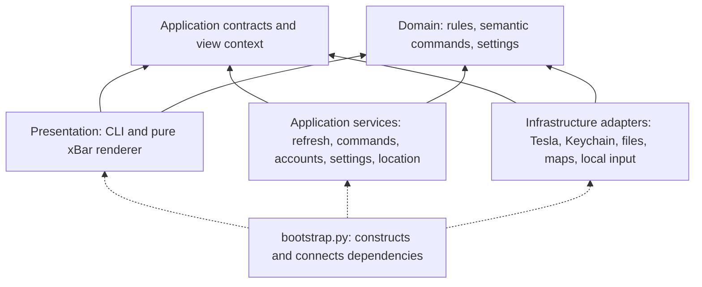

# Architecture and dependency boundaries

Tesla xBar has four layers, connected by one composition root. A refresh still runs as a short-lived process scheduled by xBar. The refactor adds no daemon, polling timer, Python dependency or extra vehicle request.

Arrows show source-code dependencies, not the direction of network traffic. Application services call interfaces defined in their own layer; the composition root supplies concrete adapters. No service imports the Tesla HTTP client, the Go command helper, a filesystem module or a menu renderer. No infrastructure module imports a service or presentation module.

## Layers

| Layer | Owns | Must not do |
| --- | --- | --- |
| [`domain`](../src/tesla_bar/domain/README.md) | Range/cable/freshness rules, command validation and result confirmation, settings schema, safe failures. | Read files, access credentials, inspect the current clock, make requests or start processes. |
| [`application`](../src/tesla_bar/application/README.md) | Vehicle selection, refresh, explicit waking, command preconditions and verification, account/configuration changes, location freshness and map reuse. Defines dependency ports. | Construct adapters, use HTTP URLs or status codes, decide REST versus signing, format xBar output. |
| [`presentation`](../src/tesla_bar/presentation/README.md) | CLI parsing/output, menu text/actions/images, settings form markup. | Fetch vehicle data, read profile files or start helpers. The renderer gets a prepared `MenuContext`. |
| [`infrastructure`](../src/tesla_bar/infrastructure/README.md) | Fleet API/OAuth, REST and signed command translation, Keychain, atomic files/locks, system clock, map/geocoder services, temporary input servers. | Call application use cases by importing them, or construct menu renderers. Interactive adapters receive callbacks. |
| [`bootstrap.py`](../src/tesla_bar/bootstrap.py) | Construct services and adapters, connect callbacks, prepare menu inputs, publish the resulting display and close the HTTP session. | Contain vehicle-control rules. |

The domain still describes Tesla-specific concepts, such as keeper modes and reported range. Separation means those rules do not depend on how data is fetched or stored; it does not require a generic application for every car brand.

## One vehicle gateway

`VehicleGateway` defines semantic operations: list vehicles, read a normalized snapshot, read connection state and capabilities, and `execute(VehicleCommand(...))`. All physical actions, including wake, pass through this one command operation. The command carries a VIN, a semantic name and an optional temperature. Every action remains pinned to the vehicle that was displayed when clicked.

| Request from a service | Implementation inside `TeslaGateway` |
| --- | --- |
| List/read/status | Fleet API request; unwrap and filter Tesla JSON into the application reading. Convert timestamps to seconds. |
| Read capabilities | Keep raw signing details inside the adapter; expose consent and whether vehicle-key pairing is needed. |
| Execute `wake` | Fleet API wake request, once. The service controls the bounded wait for availability. |
| Execute another command | Use the cached, VIN-bound capability result to select legacy REST or the official Tesla `tesla-control` helper. |

Only [`command_transport.py`](../src/tesla_bar/infrastructure/command_transport.py) maps semantic names to Tesla REST endpoints, request bodies and CLI arguments. User-visible command labels and validation live in the domain. The HTTP client no longer imports command orchestration, so there is no API ↔ command-service cycle.

A new backend can implement the same port without changing command preconditions, confirmation rules or menu code. Choosing how to communicate with Tesla remains an adapter decision.

## Invocation flow

1. xBar runs its generated shell wrapper; the Python entrypoint calls `bootstrap.main()`.
2. The CLI parses a `Request`; `PluginService` loads configuration through the `Profile` port.
3. A normal refresh gets vehicle availability and, when online, one combined reading. An unavailable car retains its last reading. Normal refresh never calls `execute`.
4. An explicit command acquires the profile lock without queueing, validates the clicked VIN and permissions, wakes if needed, validates current conditions, executes and reads back the result. An acknowledgement alone is not treated as a confirmed lock/trunk/climate transition.
5. The service returns a `Result`, containing data rather than menu text. Bootstrap supplies a single timestamp, launcher path, optional image bytes and action notices in `MenuContext`.
6. `MenuRenderer` returns xBar text deterministically from those inputs. The display adapter publishes it atomically. Network connections close at the end of the invocation.

## Configuration, authentication and storage

The [domain settings schema](../src/tesla_bar/domain/settings.py) provides defaults and validation. `SettingsService` owns the effects of saving credentials, including preserving readings for the same Client ID and clearing the old account when it changes. Terminal prompts and the short-lived browser form call that same service through supplied callbacks.

`AccountService` owns registration metadata and the profile changes after sign-in. The OAuth adapter owns protocol details and token exchange/renewal in Keychain. After an allowed region is discovered, the service saves it; failed discovery retains the selected region. Renewed consent preserves the last reading. A callback from a replaced Client ID is rejected before token exchange.

`Profile` uses named records, not filesystem paths. `FileProfile` maps them to the existing private files and handles compatibility with earlier retry/capability metadata. `Clock` makes time explicit and replaceable in tests. Location services depend on `MapMedia` and `Geocoder`; the map provider URL, PNG validation and native helper calls remain in infrastructure.

The existing private profile, Keychain accounts, wrapper interval, icons and compiled helpers are reused. Nested Python packages are shipped in a deterministic `tesla-runtime.zip`, installed atomically. The entrypoint no longer re-exports implementation functions; historical fixture composition lives only in `tests/harness.py` and is never installed.

## Enforcing separation

[`test_layers.py`](../tests/test_layers.py) checks imports in every runtime file, including imports inside functions. It rejects forbidden layer dependencies, cycles and external-effect dependencies in the core. It also runs refresh, wake/unlock, climate shutdown, retry and account use cases with in-memory ports, and renders a menu while filesystem/network/process/clock calls are forbidden.

Existing behavior and adapter integration tests still cover raw Tesla responses, command payloads, OAuth/settings callbacks, HTTPS reuse, maps, icons and installation. The installer test executes the nested zip bundle from an isolated profile. No test sends a real vehicle command.
